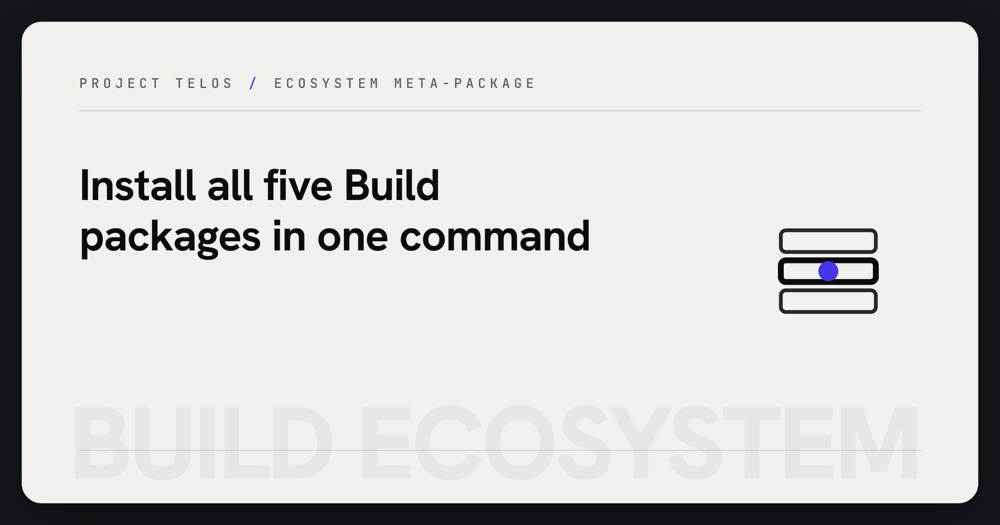

<p align="center">
  
</p>
<!-- Project mark: docs/brand/build-ecosystem-mark.svg -->

# Build Ecosystem

> One-command meta-package for the full Build family: color science, algorithmic trading, time-series forecasting, self-improving prediction, display calibration, and the shared UI layer.

[Project Telos](https://harperz9.github.io) | [gather](https://github.com/HarperZ9/gather) | [crucible](https://github.com/HarperZ9/crucible) | [index](https://github.com/HarperZ9/index) | [forum](https://github.com/HarperZ9/forum) | [telos](https://github.com/HarperZ9/telos) | [emet](https://github.com/HarperZ9/emet) | [buildlang](https://github.com/HarperZ9/buildlang)

[](https://github.com/HarperZ9/build-ecosystem/actions/workflows/ci.yml)


[](LICENSE)

Complete Build ecosystem meta-package. Installs all five Build packages in one command: color science, algorithmic trading, time series forecasting, self-improving prediction engine, and display calibration.

## Installation

```bash
pip install build-ecosystem
```

With GUI support:

```bash
pip install build-ecosystem[gui]
```

## Included Packages

- **build-color** -- Professional color science library
- **build-finance** -- Algorithmic trading toolkit
- **build-oracle** -- Time series forecasting and anomaly detection
- **build-engine** -- Self-improving prediction and trading engine
- **calibrate-pro** -- Professional display calibration

## Repository

[https://github.com/HarperZ9/build-ecosystem](https://github.com/HarperZ9/build-ecosystem)
