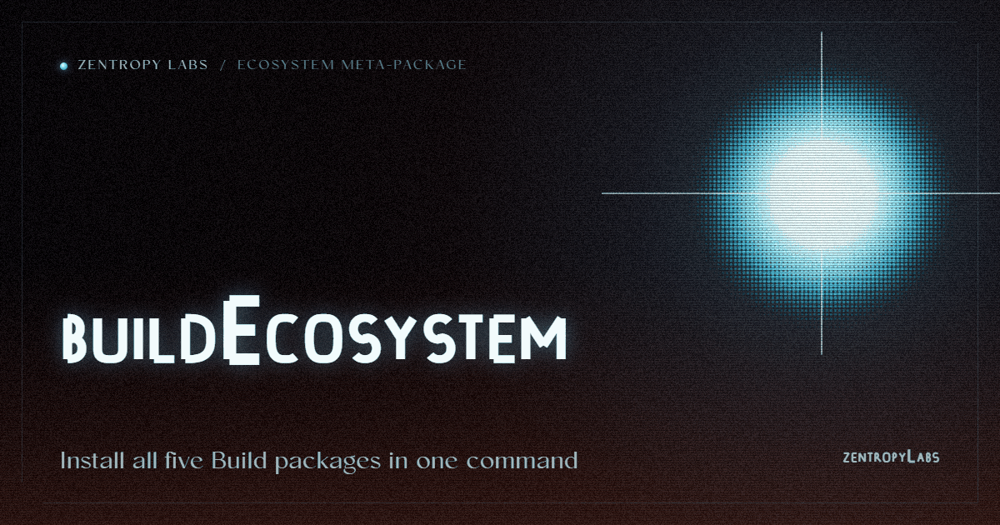

<p align="center">
  
</p>
<!-- Project mark: docs/brand/build-ecosystem-mark.svg -->

# Build Ecosystem

> One-command meta-package for the full Build family: color science, algorithmic trading, time-series forecasting, self-improving prediction, display calibration, and the shared UI layer.

[Project Telos](https://harperz9.github.io) | [gather](https://github.com/HarperZ9/gather) | [crucible](https://github.com/HarperZ9/crucible) | [index](https://github.com/HarperZ9/index) | [forum](https://github.com/HarperZ9/forum) | [telos](https://github.com/HarperZ9/telos) | [emet](https://github.com/HarperZ9/emet) | [buildlang](https://github.com/HarperZ9/buildlang)

[](https://github.com/HarperZ9/build-ecosystem/actions/workflows/ci.yml)


[](LICENSE)

Complete Build ecosystem meta-package. It is the version-pinning hub for the Build family: color science, algorithmic trading, time-series forecasting, self-improving prediction, display calibration, and the shared UI layer.

## Installation

`build-ecosystem` is not published on PyPI yet, and one member dependency (`build-finance`) is also not available from PyPI. Until those registry entries exist, install this repository from source for metadata and smoke checks:

```bash
git clone https://github.com/HarperZ9/build-ecosystem.git
cd build-ecosystem
python -m pip install -e ".[test]" --no-deps
python -c "import build_ecosystem; print(build_ecosystem.__version__)"
```

The published member packages currently available on PyPI are `build-color`, `build-oracle`, `build-engine`, `calibrate-pro`, and `build-ui`. Install `build-finance` from its owning repository until it has a registry release. Do not use `pip install build-ecosystem` until the PyPI package exists.

## Included Packages

- **build-color** -- Professional color science library
- **build-finance** -- Algorithmic trading toolkit
- **build-oracle** -- Time series forecasting and anomaly detection
- **build-engine** -- Self-improving prediction and trading engine
- **calibrate-pro** -- Professional display calibration

## Repository

[https://github.com/HarperZ9/build-ecosystem](https://github.com/HarperZ9/build-ecosystem)

---

**[Zentropy Labs](https://github.com/ZentropyLabs-ai)** · order out of entropy. An independent lab building evidence-first tools that leave a re-checkable artifact behind. Built by Zain Dana Harper in Seattle. The full workbench is at [Project Telos](https://harperz9.github.io).
